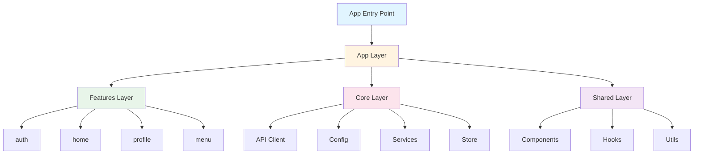
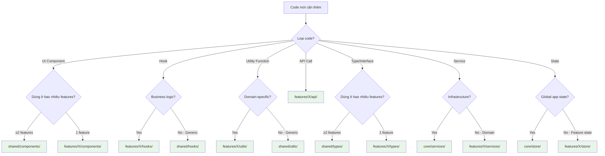

# Architecture Guide - Domain-Driven Feature Structure

## Tổng Quan Kiến Trúc

Dự án này sử dụng kiến trúc **Domain-Driven Design (DDD)** kết hợp với **Feature-Based Organization**. Mỗi feature đại diện cho một business domain độc lập, tự chứa toàn bộ logic, UI, và data liên quan.



## Domain-Driven Concept in Features

### What is a Domain?

**Domain** = **Business Domain** = **Business area** in your application.

Each feature represents a **domain/business domain** that is self-contained with all related logic, UI, and data.

### Domain Examples in E-commerce App:

```
features/
├── auth/          # Domain: Authentication & Authorization
│   ├── Login, Register, Forgot Password
│   ├── User session management
│   └── Token handling
│
├── product/       # Domain: Product Management
│   ├── Product listing, search, filter
│   ├── Product details
│   ├── Product reviews
│   └── Product categories
│
├── cart/          # Domain: Shopping Cart
│   ├── Add/remove items
│   ├── Update quantities
│   ├── Cart summary
│   └── Checkout flow
│
├── order/          # Domain: Order Management
│   ├── Order history
│   ├── Order details
│   ├── Order tracking
│   └── Order status
│
├── payment/        # Domain: Payment Processing
│   ├── Payment methods
│   ├── Payment gateway
│   └── Payment history
│
└── profile/        # Domain: User Profile
    ├── User info
    ├── Settings
    ├── Addresses
    └── Preferences
```

## 🎯 Domain-Driven Features Principles

### 1. **Self-Contained**

Each feature contains ALL code related to that domain:

```
features/product/
├── api/              # API calls for products
│   └── productApi.ts
├── components/       # UI components only for products
│   ├── ProductCard.tsx
│   ├── ProductList.tsx
│   └── ProductFilter.tsx
├── hooks/            # Custom hooks for product logic
│   ├── useProducts.ts
│   ├── useProductDetail.ts
│   └── useProductSearch.ts
├── screens/          # Screens of product domain
│   ├── ProductListScreen.tsx
│   ├── ProductDetailScreen.tsx
│   └── ProductSearchScreen.tsx
├── store/            # State management (if needed)
│   └── productStore.ts
├── types/            # Types only for products
│   └── product.types.ts
└── index.ts          # Public API - export to outside
```

### 2. **Clear Boundaries**

Each feature is an **independent module** that can:
- ✅ Work independently
- ✅ Be tested separately
- ✅ Allow different teams to work in parallel
- ✅ Be easily maintained and refactored

### 3. **Public API via index.ts**

Only export what's necessary:

```typescript
// features/product/index.ts
export {ProductListScreen, ProductDetailScreen} from './screens';
export {useProducts, useProductDetail} from './hooks';
export {productApi} from './api';
export type {Product, ProductFilter} from './types';
```

**Other features should only import from index.ts:**

```typescript
// features/home/screens/HomeScreen.tsx
import {Product, useProducts} from '@/features/product'; // ✅ Good
// DO NOT import directly:
// import {Product} from '@/features/product/types/product.types'; // ❌ Bad
```

## 📋 Feature Organization Rules

### ✅ DO

1. **Each feature = 1 domain**
   ```
   features/
   ├── auth/        # Domain: Authentication
   ├── product/     # Domain: Products
   ├── cart/        # Domain: Shopping Cart
   └── order/       # Domain: Orders
   ```

2. **All related code in the feature**
   - API calls → `api/`
   - UI components → `components/`
   - Business logic → `hooks/`
   - Screens → `screens/`
   - Types → `types/`

3. **Shared code → `shared/`**
   - Button, Input, Container → `shared/components/`
   - useDebounce, useKeyboard → `shared/hooks/`
   - Validation, formatters → `shared/utils/`

### ❌ DON'T

1. **DO NOT mix domains in 1 feature**
   ```
   ❌ features/product/
       ├── productApi.ts
       ├── cartApi.ts      # ❌ Cart doesn't belong to product domain
       └── orderApi.ts     # ❌ Order doesn't belong to product domain
   ```

2. **DO NOT import directly into internal files**
   ```typescript
   ❌ import {Product} from '@/features/product/types/product.types';
   ✅ import {Product} from '@/features/product';
   ```

3. **DO NOT put business logic in shared**
   ```
   ❌ shared/utils/productHelpers.ts  # ❌ Product logic is not shared
   ✅ features/product/utils/productHelpers.ts  # ✅ Correct
   ```

## 🔄 Workflow When Adding a New Feature

### Step 1: Identify Domain

**Question:** Which domain does this feature belong to?

Examples:
- "I need to create a login screen" → Domain: `auth`
- "I need to create a shopping cart" → Domain: `cart`
- "I need to create payment" → Domain: `payment`

### Step 2: Create Feature Structure

```bash
mkdir -p features/{feature-name}/{api,components,hooks,screens,store,types}
```

### Step 3: Implement in Order

1. **Types** (`types/`) - Define data structures
2. **API** (`api/`) - API calls
3. **Hooks** (`hooks/`) - Business logic with React Query
4. **Components** (`components/`) - UI components
5. **Screens** (`screens/`) - Container components
6. **Store** (`store/`) - If local state is needed (Zustand)
7. **index.ts** - Export public API

### Step 4: Use in App

```typescript
// app/navigation/AppNavigator.tsx
import {ProductListScreen} from '@/features/product';
import {CartScreen} from '@/features/cart';
```

## 📊 Comparison: Domain-Driven vs Component-Based

### ❌ Component-Based (Not good for scale)

```
src/
├── components/
│   ├── ProductCard.tsx
│   ├── ProductList.tsx
│   ├── CartItem.tsx
│   ├── OrderCard.tsx
│   └── ... (100+ components)
├── screens/
│   ├── ProductScreen.tsx
│   ├── CartScreen.tsx
│   └── ...
├── api/
│   ├── productApi.ts
│   ├── cartApi.ts
│   └── ...
└── hooks/
    ├── useProducts.ts
    ├── useCart.ts
    └── ...
```

### ✅ Domain-Driven (Good for scale)

```
src/
├── features/
│   ├── product/
│   │   ├── api/
│   │   ├── components/
│   │   ├── hooks/
│   │   ├── screens/
│   │   └── types/
│   ├── cart/
│   │   ├── api/
│   │   ├── components/
│   │   ├── hooks/
│   │   └── screens/
│   └── order/
│       └── ...
└── shared/
    ├── components/  # Only shared components
    └── hooks/      # Only shared hooks
```

**Benefits:**
- ✅ Easy to find code (all in 1 folder)
- ✅ Easy to maintain (clear which domain)
- ✅ Teams can work in parallel (each person 1 feature)
- ✅ Easy to test (test each feature)
- ✅ Easy to scale (add new feature = add new folder)

## 🎯 Real Example: "Product" Feature

### Structure:

```
features/product/
├── api/
│   └── productApi.ts          # API calls
├── components/
│   ├── ProductCard.tsx       # UI component
│   ├── ProductList.tsx       # UI component
│   └── ProductFilter.tsx     # UI component
├── hooks/
│   ├── useProducts.ts        # Fetch products
│   ├── useProductDetail.ts   # Fetch product detail
│   └── useProductSearch.ts   # Search products
├── screens/
│   ├── ProductListScreen.tsx # Container (business logic)
│   └── ProductDetailScreen.tsx
├── types/
│   └── product.types.ts       # Product types
└── index.ts                   # Export public API
```

### Usage:

```typescript
// features/home/screens/HomeScreen.tsx
import {Product, useProducts} from '@/features/product';

export function HomeScreen() {
  const {data: products} = useProducts();
  // ...
}
```

## 🚀 Benefits When Scaling

1. **Team Collaboration**
   - Developer A works on `product` feature
   - Developer B works on `cart` feature
   - No conflicts, no need for frequent merges

2. **Code Organization**
   - Quick to find code: "Product logic? → `features/product/`"
   - Clear dependencies between features

3. **Testing**
   - Test each feature independently
   - Easy to mock dependencies

4. **Refactoring**
   - Refactor 1 feature doesn't affect others
   - Easy to migrate or remove features

## 📝 Checklist When Creating a New Feature

- [ ] Identify domain clearly
- [ ] Create complete folder structure
- [ ] Define types first
- [ ] Implement API calls
- [ ] Create hooks with React Query
- [ ] Create UI components
- [ ] Create screens (container)
- [ ] Export public API via index.ts
- [ ] Do not import directly into internal files

## 🏗️ Core Infrastructure

Core layer chứa các infrastructure components được sử dụng xuyên suốt ứng dụng. Đây là foundation layer cung cấp các services cơ bản.

### Structure:

```
core/
├── api/              # API client configuration
├── config/           # App configuration
├── services/         # Shared services
└── store/            # Global app state
```

### 1. Core API (`core/api/`)

**Mục đích:** Centralized API client với interceptors cho authentication và error handling.

**Files:**
- `client.ts` - Axios instance với interceptors
- `endpoints.ts` - API endpoint constants
- `index.ts` - Public exports

**Example từ codebase:**

```typescript
// core/api/client.ts
import axios, {AxiosInstance} from 'axios';
import {ENV} from '@/core/config/env';

export const apiClient: AxiosInstance = axios.create({
  baseURL: ENV.API_URL,
  timeout: ENV.API_TIMEOUT,
  headers: {
    'Content-Type': 'application/json',
  },
});

// Request interceptor - Add auth token
apiClient.interceptors.request.use(
  (config: any) => {
    const token = useAuthStore.getState().token;
    if (token && config.headers) {
      config.headers.Authorization = `Bearer ${token}`;
    }
    return config;
  },
  error => Promise.reject(error),
);

// Response interceptor - Handle errors
apiClient.interceptors.response.use(
  (response) => response,
  (error) => {
    if (error.response?.status === 401) {
      useAuthStore.getState().logout();
    }
    return Promise.reject(error);
  },
);
```

**Usage trong features:**

```typescript
// features/home/api/homeApi.ts
import {apiClient} from '@/core/api';

export const homeApi = {
  getProducts: async () => {
    const response = await apiClient.get('/products');
    return response.data;
  },
};
```

### 2. Core Config (`core/config/`)

**Mục đích:** Centralized configuration cho app settings, theme, và environment variables.

**Files:**
- `env.ts` - Environment variables (API_URL, API_TIMEOUT, etc.)
- `theme.ts` - App theme configuration
- `antd-theme.ts` - Ant Design theme customization
- `index.ts` - Public exports

**Example:**

```typescript
// core/config/env.ts
export const ENV = {
  API_URL: process.env.API_URL || 'https://api.example.com',
  API_TIMEOUT: 30000,
  APP_NAME: 'BaseStructure',
};

// Usage
import {ENV} from '@/core/config';
console.log(ENV.API_URL);
```

### 3. Core Services (`core/services/`)

**Mục đích:** Shared services không thuộc về domain cụ thể nào.

**Files:**
- `storage.service.ts` - MMKV storage wrapper (cho Zustand persist)
- `analytics.service.ts` - Analytics tracking
- `notification.service.ts` - Push notifications
- `index.ts` - Public exports

**Example từ codebase:**

```typescript
// core/services/storage.service.ts
import {MMKV} from 'react-native-mmkv';

export const storage = new MMKV({
  id: 'app-storage',
});

// Storage adapter for Zustand persist
export const Storage = {
  setItem: (key: string, value: string): void => {
    storage.set(key, value);
  },
  getItem: (key: string): string | null => {
    const value = storage.getString(key);
    return value ?? null;
  },
  removeItem: (key: string): void => {
    storage.delete(key);
  },
};
```

**Usage:**

```typescript
// features/auth/store/authStore.ts
import {create} from 'zustand';
import {persist, createJSONStorage} from 'zustand/middleware';
import {Storage} from '@/core/services';

export const useAuthStore = create()(
  persist(
    (set) => ({
      user: null,
      token: null,
      login: async (credentials) => { /* ... */ },
    }),
    {
      name: 'auth-storage',
      storage: createJSONStorage(() => Storage),
    },
  ),
);
```

### 4. Core Store (`core/store/`)

**Mục đích:** Global app state không thuộc về feature cụ thể (theme, language, app settings).

**Example:**

```typescript
// core/store/store.ts
import {create} from 'zustand';

interface AppState {
  theme: 'light' | 'dark';
  language: 'vi' | 'en';
  setTheme: (theme: 'light' | 'dark') => void;
  setLanguage: (language: 'vi' | 'en') => void;
}

export const useAppStore = create<AppState>((set) => ({
  theme: 'light',
  language: 'vi',
  setTheme: (theme) => set({theme}),
  setLanguage: (language) => set({language}),
}));
```

## 🔧 Shared Resources

Shared layer chứa các reusable components, hooks, và utilities được sử dụng xuyên suốt nhiều features.

### Structure:

```
shared/
├── components/       # Reusable UI components
├── hooks/            # Reusable custom hooks
├── utils/            # Utility functions
├── constants/        # App constants
└── types/            # Shared TypeScript types
```

### 1. Shared Components (`shared/components/`)

**Mục đích:** UI components được tái sử dụng xuyên suốt nhiều features.

**Categories:**
- **Buttons:** Button, BackButton, Badge
- **Forms:** Input, SegmentedControl
- **Layout:** Container, SafeArea, Divider, PageIndicator
- **Typography:** Text, TextLink
- **Brand:** Logo
- **Avatar:** Avatar
- **Error:** ErrorBoundary

**Example từ codebase:**

```typescript
// shared/components/index.ts
export * from './buttons/Button';
export * from './buttons/BackButton';
export * from './forms/Input';
export * from './layout/Container';
export * from './typography/Text';
// ... more exports
```

**Usage:**

```typescript
// features/home/screens/HomeScreen.tsx
import {Container, Text, Button} from '@/shared/components';

export function HomeScreen() {
  return (
    <Container>
      <Text variant="h1">Welcome</Text>
      <Button onPress={() => {}}>Get Started</Button>
    </Container>
  );
}
```

**Quy tắc:**
- ✅ Component được dùng ở ≥2 features → `shared/components/`
- ❌ Component chỉ dùng trong 1 feature → `features/{feature}/components/`

### 2. Shared Hooks (`shared/hooks/`)

**Mục đích:** Custom hooks không liên quan đến business logic cụ thể.

**Examples từ codebase:**

```typescript
// shared/hooks/useDebounce.ts
export function useDebounce<T>(value: T, delay: number): T {
  const [debouncedValue, setDebouncedValue] = useState<T>(value);

  useEffect(() => {
    const handler = setTimeout(() => {
      setDebouncedValue(value);
    }, delay);
    return () => clearTimeout(handler);
  }, [value, delay]);

  return debouncedValue;
}

// shared/hooks/useKeyboard.ts
export function useKeyboard() {
  const [keyboardHeight, setKeyboardHeight] = useState(0);
  // ... keyboard event listeners
  return {keyboardHeight, isKeyboardVisible};
}
```

**Usage:**

```typescript
// features/auth/screens/LoginScreen.tsx
import {useDebounce, useKeyboard} from '@/shared/hooks';

export function LoginScreen() {
  const [searchTerm, setSearchTerm] = useState('');
  const debouncedSearch = useDebounce(searchTerm, 500);
  const {isKeyboardVisible} = useKeyboard();
  // ...
}
```

**Quy tắc:**
- ✅ Generic hooks (debounce, keyboard, etc.) → `shared/hooks/`
- ❌ Business logic hooks (useProducts, useAuth) → `features/{feature}/hooks/`

### 3. Shared Utils (`shared/utils/`)

**Mục đích:** Utility functions không liên quan đến domain cụ thể.

**Files:**
- `formatters.ts` - Format date, currency, phone, etc.
- `validation.ts` - Validation functions (email, phone, etc.)
- `helpers.ts` - General helper functions
- `errorHandler.ts` - Error handling utilities

**Example:**

```typescript
// shared/utils/formatters.ts
export const formatters = {
  currency: (amount: number) => {
    return new Intl.NumberFormat('vi-VN', {
      style: 'currency',
      currency: 'VND',
    }).format(amount);
  },

  date: (date: Date) => {
    return new Intl.DateTimeFormat('vi-VN').format(date);
  },

  phone: (phone: string) => {
    return phone.replace(/(\d{4})(\d{3})(\d{3})/, '$1 $2 $3');
  },
};

// shared/utils/validation.ts
export const validation = {
  email: (email: string) => {
    const regex = /^[^\s@]+@[^\s@]+\.[^\s@]+$/;
    return regex.test(email);
  },

  phone: (phone: string) => {
    const regex = /^(0|\+84)[0-9]{9}$/;
    return regex.test(phone);
  },
};
```

**Usage:**

```typescript
// features/profile/screens/ProfileScreen.tsx
import {formatters, validation} from '@/shared/utils';

const formattedPrice = formatters.currency(100000);
const isValidEmail = validation.email('user@example.com');
```

### 4. Shared Constants (`shared/constants/`)

**Mục đích:** App-wide constants.

**Files:**
- `routes.ts` - Navigation route names
- `config.ts` - App configuration constants

**Example:**

```typescript
// shared/constants/routes.ts
export const ROUTES = {
  AUTH: {
    LOGIN: 'Login',
    REGISTER: 'Register',
  },
  MAIN: {
    HOME: 'Home',
    PROFILE: 'Profile',
    MENU: 'Menu',
  },
} as const;
```

### 5. Shared Types (`shared/types/`)

**Mục đích:** TypeScript types được dùng xuyên suốt nhiều features.

**Example:**

```typescript
// shared/types/common.types.ts
export interface ApiResponse<T> {
  data: T;
  message: string;
  success: boolean;
}

export interface PaginationParams {
  page: number;
  limit: number;
}

export interface PaginatedResponse<T> {
  data: T[];
  total: number;
  page: number;
  limit: number;
}
```

## 🔗 Path Aliases

Path aliases giúp import code dễ dàng hơn và tránh relative paths phức tạp.

### Configuration

```json
// tsconfig.json
{
  "compilerOptions": {
    "paths": {
      "@/*": ["./src/*"],
      "@/app/*": ["./src/app/*"],
      "@/features/*": ["./src/features/*"],
      "@/shared/*": ["./src/shared/*"],
      "@/core/*": ["./src/core/*"],
      "@/assets/*": ["./src/assets/*"],
      "@/styles/*": ["./src/styles/*"]
    }
  }
}
```

### Available Aliases

| Alias | Path | Usage |
|-------|------|-------|
| `@/` | `src/` | Root imports |
| `@/app/*` | `src/app/*` | App layer (navigation, providers) |
| `@/features/*` | `src/features/*` | Feature modules |
| `@/shared/*` | `src/shared/*` | Shared resources |
| `@/core/*` | `src/core/*` | Core infrastructure |
| `@/assets/*` | `src/assets/*` | Images, fonts, etc. |
| `@/styles/*` | `src/styles/*` | Design system |

### Examples

```typescript
// ❌ Bad - Relative paths
import {Button} from '../../../shared/components/buttons/Button';
import {colors} from '../../../../styles/colors';
import {useAuth} from '../../auth/hooks/useAuth';

// ✅ Good - Path aliases
import {Button} from '@/shared/components';
import {colors} from '@/styles';
import {useAuth} from '@/features/auth';
```

### Benefits

1. **Dễ đọc:** Code rõ ràng hơn, không có `../../../`
2. **Dễ refactor:** Di chuyển files không cần update imports
3. **Autocomplete tốt hơn:** IDE suggest paths chính xác
4. **Tránh lỗi:** Không bị nhầm lẫn về relative paths

## 🚀 Workflow Examples

### Workflow 1: Thêm Feature Mới

**Scenario:** Cần tạo feature "notifications" để quản lý thông báo.

**Step 1: Tạo folder structure**

```bash
mkdir -p src/features/notifications/{api,components,hooks,screens,store,types}
touch src/features/notifications/index.ts
```

**Step 2: Define types**

```typescript
// features/notifications/types/notification.types.ts
export interface Notification {
  id: string;
  title: string;
  message: string;
  type: 'info' | 'success' | 'warning' | 'error';
  read: boolean;
  createdAt: string;
}

export interface NotificationFilter {
  read?: boolean;
  type?: string;
}
```

**Step 3: Create API module**

```typescript
// features/notifications/api/notificationApi.ts
import {apiClient} from '@/core/api';
import {Notification} from '../types/notification.types';

export const notificationApi = {
  getNotifications: async (): Promise<Notification[]> => {
    const response = await apiClient.get('/notifications');
    return response.data;
  },

  markAsRead: async (id: string): Promise<void> => {
    await apiClient.patch(`/notifications/${id}/read`);
  },
};
```

**Step 4: Create hooks with React Query**

```typescript
// features/notifications/hooks/useNotifications.ts
import {useQuery, useMutation, useQueryClient} from '@tanstack/react-query';
import {notificationApi} from '../api/notificationApi';

export function useNotifications() {
  return useQuery({
    queryKey: ['notifications'],
    queryFn: notificationApi.getNotifications,
  });
}

export function useMarkAsRead() {
  const queryClient = useQueryClient();

  return useMutation({
    mutationFn: notificationApi.markAsRead,
    onSuccess: () => {
      queryClient.invalidateQueries({queryKey: ['notifications']});
    },
  });
}
```

**Step 5: Create components**

```typescript
// features/notifications/components/NotificationCard.tsx
import React from 'react';
import {View} from 'react-native';
import {Text} from '@/shared/components';
import {Notification} from '../types/notification.types';

interface Props {
  notification: Notification;
  onPress: () => void;
}

export function NotificationCard({notification, onPress}: Props) {
  return (
    <View>
      <Text variant="h3">{notification.title}</Text>
      <Text>{notification.message}</Text>
    </View>
  );
}
```

**Step 6: Create screen**

```typescript
// features/notifications/screens/NotificationListScreen.tsx
import React from 'react';
import {FlatList} from 'react-native';
import {Container} from '@/shared/components';
import {useNotifications, useMarkAsRead} from '../hooks/useNotifications';
import {NotificationCard} from '../components/NotificationCard';

export function NotificationListScreen() {
  const {data: notifications, isLoading} = useNotifications();
  const markAsRead = useMarkAsRead();

  return (
    <Container>
      <FlatList
        data={notifications}
        renderItem={({item}) => (
          <NotificationCard
            notification={item}
            onPress={() => markAsRead.mutate(item.id)}
          />
        )}
      />
    </Container>
  );
}
```

**Step 7: Export public API**

```typescript
// features/notifications/index.ts
export {NotificationListScreen} from './screens/NotificationListScreen';
export {useNotifications, useMarkAsRead} from './hooks/useNotifications';
export {notificationApi} from './api/notificationApi';
export type {Notification, NotificationFilter} from './types/notification.types';
```

**Step 8: Add to navigation**

```typescript
// app/navigation/MainNavigator.tsx
import {NotificationListScreen} from '@/features/notifications';

export function MainNavigator() {
  return (
    <Stack.Navigator>
      {/* ... other screens */}
      <Stack.Screen
        name="Notifications"
        component={NotificationListScreen}
      />
    </Stack.Navigator>
  );
}
```

### Workflow 2: Thêm Screen Mới vào Feature Hiện Tại

**Scenario:** Feature "home" đã có, cần thêm "ProductDetailScreen".

**Step 1: Create screen**

```typescript
// features/home/screens/ProductDetailScreen.tsx
import React from 'react';
import {Container, Text} from '@/shared/components';
import {useProductDetail} from '../hooks/useProducts';

interface Props {
  route: {params: {productId: string}};
}

export function ProductDetailScreen({route}: Props) {
  const {productId} = route.params;
  const {data: product, isLoading} = useProductDetail(productId);

  if (isLoading) return <Text>Loading...</Text>;

  return (
    <Container>
      <Text variant="h1">{product?.name}</Text>
      <Text>{product?.description}</Text>
    </Container>
  );
}
```

**Step 2: Export từ feature index**

```typescript
// features/home/index.ts
export {HomeScreen} from './screens/HomeScreen';
export {ProductDetailScreen} from './screens/ProductDetailScreen'; // ← Add this
export {useProducts, useProductDetail} from './hooks/useProducts';
```

**Step 3: Add to navigation**

```typescript
// app/navigation/MainNavigator.tsx
import {HomeScreen, ProductDetailScreen} from '@/features/home';

<Stack.Screen name="Home" component={HomeScreen} />
<Stack.Screen name="ProductDetail" component={ProductDetailScreen} />
```

### Workflow 3: Tạo Shared Component

**Scenario:** Nhiều features cần dùng "SearchBar" component.

**Step 1: Identify reusability**

- ✅ Component được dùng ở ≥2 features → Create in `shared/components/`
- ❌ Component chỉ dùng trong 1 feature → Keep in `features/{feature}/components/`

**Step 2: Create component**

```typescript
// shared/components/forms/SearchBar.tsx
import React from 'react';
import {TextInput, View} from 'react-native';
import {colors} from '@/styles';

interface Props {
  value: string;
  onChangeText: (text: string) => void;
  placeholder?: string;
}

export function SearchBar({value, onChangeText, placeholder}: Props) {
  return (
    <View>
      <TextInput
        value={value}
        onChangeText={onChangeText}
        placeholder={placeholder}
        style={{backgroundColor: colors.background.secondary}}
      />
    </View>
  );
}
```

**Step 3: Export từ shared/components**

```typescript
// shared/components/index.ts
export * from './forms/SearchBar';
```

**Step 4: Use in features**

```typescript
// features/home/screens/HomeScreen.tsx
import {SearchBar} from '@/shared/components';

export function HomeScreen() {
  const [search, setSearch] = useState('');

  return (
    <SearchBar
      value={search}
      onChangeText={setSearch}
      placeholder="Tìm kiếm sản phẩm..."
    />
  );
}
```

### Workflow 4: Refactor Code giữa Features

**Scenario:** Component "ProductCard" ban đầu trong `features/home/components/` nhưng giờ `features/menu/` cũng cần dùng.

**Step 1: Move component**

```bash
# Move file
mv src/features/home/components/ProductCard.tsx src/shared/components/cards/ProductCard.tsx
```

**Step 2: Update imports trong component**

```typescript
// shared/components/cards/ProductCard.tsx
// Before
import {Text} from '../../shared/components';

// After
import {Text} from '@/shared/components';
```

**Step 3: Export từ shared/components**

```typescript
// shared/components/index.ts
export * from './cards/ProductCard';
```

**Step 4: Update imports trong features**

```typescript
// features/home/screens/HomeScreen.tsx
// Before
import {ProductCard} from '../components/ProductCard';

// After
import {ProductCard} from '@/shared/components';
```

```typescript
// features/menu/screens/MenuScreen.tsx
import {ProductCard} from '@/shared/components';
```

### Decision Tree: Tổ Chức Code Mới



---

**Summary:** Domain-Driven = Each feature is a self-contained "mini app" representing a specific business domain.
