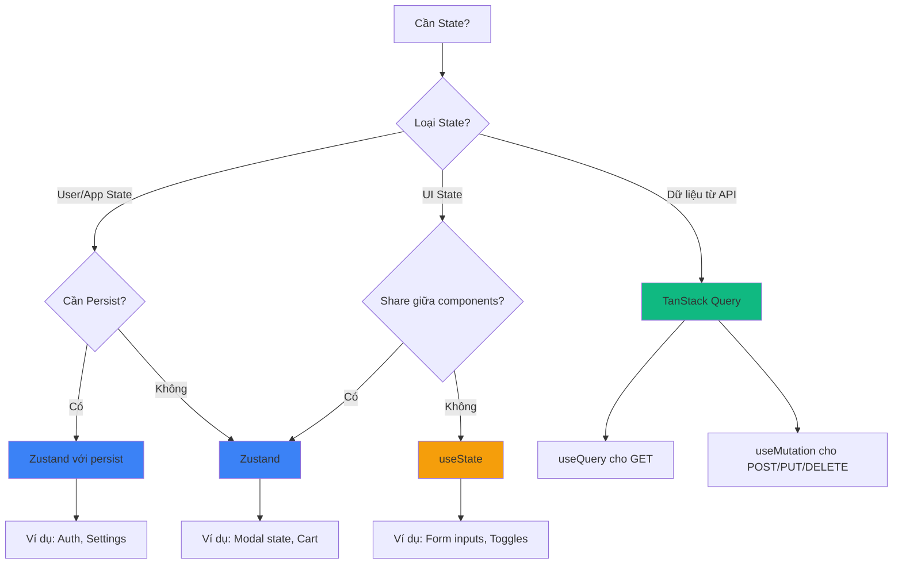

# 🗄️ State Management Guide

## 📖 Tổng Quan

Dự án sử dụng 3 công cụ quản lý state khác nhau, mỗi công cụ phục vụ một mục đích cụ thể:

- **Zustand** - Client state (user preferences, UI state, app state)
- **TanStack Query** - Server state (API data, caching, refetching)
- **React useState** - Local component state (form inputs, toggles)

## 🎯 State Management Philosophy

### Client State vs Server State

**Client State** là dữ liệu thuộc về ứng dụng:
- User preferences (theme, language)
- UI state (modal open/closed, drawer state)
- Form state (complex forms)
- Authentication state (user info, token)
- App configuration

**Server State** là dữ liệu từ backend:
- API responses
- Database records
- Real-time data
- Paginated lists
- Search results

### Tại Sao Cần Tách Biệt?

Server state có những đặc điểm riêng:
- Được lưu trữ ở remote location
- Cần asynchronous APIs để fetch/update
- Có thể bị outdated
- Cần caching và refetching
- Có thể được shared giữa nhiều users

Client state thì đơn giản hơn:
- Được lưu trữ local
- Synchronous access
- Hoàn toàn thuộc quyền kiểm soát của app
- Không cần caching phức tạp

## 🔵 Zustand for Client State

### Khi Nào Dùng Zustand?

✅ **Nên dùng Zustand khi:**
- Cần share state giữa nhiều components không liên quan
- Cần persist state (lưu vào storage)
- State phức tạp với nhiều actions
- Global app state (theme, language, auth)
- UI state cần access từ nhiều nơi

❌ **Không nên dùng Zustand khi:**
- Dữ liệu từ API (dùng TanStack Query)
- State chỉ dùng trong 1 component (dùng useState)
- Temporary UI state (loading, hover)

### Tạo Store Cơ Bản

```typescript
// features/auth/store/authStore.ts
import {create} from 'zustand';

interface AuthState {
  user: User | null;
  isAuthenticated: boolean;
  login: (user: User) => void;
  logout: () => void;
}

export const useAuthStore = create<AuthState>(set => ({
  user: null,
  isAuthenticated: false,

  login: (user) => set({
    user,
    isAuthenticated: true,
  }),

  logout: () => set({
    user: null,
    isAuthenticated: false,
  }),
}));
```

### Tạo Store với Persist Middleware

Persist middleware giúp lưu state vào storage (AsyncStorage/MMKV):

```typescript
// features/settings/store/settingsStore.ts
import {create} from 'zustand';
import {persist, createJSONStorage} from 'zustand/middleware';
import {Storage} from '@/core/services/storage.service';

interface SettingsState {
  theme: 'light' | 'dark';
  language: 'vi' | 'en';
  notifications: boolean;
  setTheme: (theme: 'light' | 'dark') => void;
  setLanguage: (language: 'vi' | 'en') => void;
  toggleNotifications: () => void;
}

export const useSettingsStore = create<SettingsState>()(
  persist(
    (set) => ({
      // Default values
      theme: 'light',
      language: 'vi',
      notifications: true,

      // Actions
      setTheme: (theme) => set({theme}),
      setLanguage: (language) => set({language}),
      toggleNotifications: () => set((state) => ({
        notifications: !state.notifications,
      })),
    }),
    {
      name: 'settings-storage', // Storage key
      storage: createJSONStorage(() => Storage),
    },
  ),
);
```

### Sử dụng Store trong Components

```typescript
// features/settings/screens/SettingsScreen.tsx
import {useSettingsStore} from '../store/settingsStore';

export function SettingsScreen() {
  // ✅ Subscribe to specific values only
  const theme = useSettingsStore(state => state.theme);
  const setTheme = useSettingsStore(state => state.setTheme);

  // ✅ Or get multiple values
  const {language, setLanguage} = useSettingsStore();

  return (
    <View>
      <Text>Current Theme: {theme}</Text>
      <Button onPress={() => setTheme('dark')}>
        Switch to Dark
      </Button>

      <Text>Language: {language}</Text>
      <Button onPress={() => setLanguage('en')}>
        Switch to English
      </Button>
    </View>
  );
}
```

### Sử dụng Store Ngoài Components

Zustand stores có thể được access từ bất kỳ đâu (không chỉ React components):

```typescript
// core/api/client.ts
import {useAuthStore} from '@/features/auth/store/authStore';

// ✅ Access store outside component
apiClient.interceptors.request.use(config => {
  const token = useAuthStore.getState().token;

  if (token && config.headers) {
    config.headers.Authorization = `Bearer ${token}`;
  }

  return config;
});

// ✅ Call actions outside component
export function handleUnauthorized() {
  useAuthStore.getState().logout();
}
```

### Store Organization Pattern

Mỗi feature có thể có store riêng:

```
features/
├── auth/
│   └── store/
│       └── authStore.ts
├── settings/
│   └── store/
│       └── settingsStore.ts
└── cart/
    └── store/
        └── cartStore.ts

core/
└── store/
    └── store.ts  # Global app store
```

### Advanced Patterns

#### 1. Computed Values với Selectors

```typescript
export const useAuthStore = create<AuthState>(set => ({
  user: null,
  token: null,

  // Computed value
  isAuthenticated: () => {
    const state = useAuthStore.getState();
    return !!state.token && !!state.user;
  },
}));

// Usage
const isAuth = useAuthStore(state => state.isAuthenticated());
```

#### 2. Async Actions

```typescript
export const useCartStore = create<CartState>(set => ({
  items: [],
  isLoading: false,

  addItem: async (product: Product) => {
    set({isLoading: true});

    try {
      // Call API
      await cartApi.addItem(product.id);

      // Update state
      set(state => ({
        items: [...state.items, product],
        isLoading: false,
      }));
    } catch (error) {
      set({isLoading: false});
      throw error;
    }
  },
}));
```

#### 3. Reset Store

```typescript
const initialState = {
  user: null,
  token: null,
  isAuthenticated: false,
};

export const useAuthStore = create<AuthState>(set => ({
  ...initialState,

  reset: () => set(initialState),

  logout: () => {
    // Clear storage
    Storage.delete('auth-storage');
    // Reset state
    set(initialState);
  },
}));
```

## 🟢 TanStack Query for Server State

### Khi Nào Dùng TanStack Query?

✅ **Luôn dùng TanStack Query cho:**
- Tất cả API calls
- Data fetching từ backend
- Caching API responses
- Background refetching
- Optimistic updates
- Pagination và infinite scroll

### Pattern: API → Hook → Screen

TanStack Query đã được document chi tiết trong [API_GUIDE.md](./API_GUIDE.md).

**Quick Reference:**

```typescript
// 1. API Layer
export const productApi = {
  getProducts: async (): Promise<Product[]> => {
    const {data} = await apiClient.get(API_ENDPOINTS.PRODUCTS.LIST);
    return data;
  },
};

// 2. Hook Layer
export function useProducts() {
  return useQuery({
    queryKey: ['products'],
    queryFn: productApi.getProducts,
  });
}

// 3. Screen Layer
export function ProductListScreen() {
  const {data, isLoading, error} = useProducts();

  if (isLoading) return <Loading />;
  if (error) return <Error />;

  return <ProductList products={data} />;
}
```

### Tại Sao Không Dùng Zustand cho Server State?

❌ **Không nên:**
```typescript
// BAD: Storing API data in Zustand
export const useProductStore = create(set => ({
  products: [],
  isLoading: false,

  fetchProducts: async () => {
    set({isLoading: true});
    const data = await productApi.getProducts();
    set({products: data, isLoading: false});
  },
}));
```

✅ **Nên:**
```typescript
// GOOD: Use TanStack Query
export function useProducts() {
  return useQuery({
    queryKey: ['products'],
    queryFn: productApi.getProducts,
  });
}
```

**Lý do:**
- TanStack Query tự động handle caching
- Auto refetch khi data stale
- Deduplicate requests
- Background updates
- Error retry logic
- Loading states
- Optimistic updates

Xem thêm patterns và examples trong [API_GUIDE.md](./API_GUIDE.md).

## 🟡 React useState for Local State

### Khi Nào Dùng useState?

✅ **Nên dùng useState khi:**
- State chỉ dùng trong 1 component
- Form inputs (simple forms)
- Toggle states (show/hide)
- Temporary UI state
- Component-specific state

❌ **Không nên dùng useState khi:**
- Cần share state giữa nhiều components
- Cần persist state
- State phức tạp với nhiều actions

### Examples

#### 1. Form Inputs

```typescript
export function LoginScreen() {
  const [email, setEmail] = useState('');
  const [password, setPassword] = useState('');

  return (
    <View>
      <Input
        value={email}
        onChangeText={setEmail}
        placeholder="Email"
      />
      <Input
        value={password}
        onChangeText={setPassword}
        placeholder="Password"
        secureTextEntry
      />
    </View>
  );
}
```

#### 2. Toggle States

```typescript
export function ProductCard({product}: Props) {
  const [isExpanded, setIsExpanded] = useState(false);

  return (
    <View>
      <Text>{product.name}</Text>
      <Button onPress={() => setIsExpanded(!isExpanded)}>
        {isExpanded ? 'Show Less' : 'Show More'}
      </Button>
      {isExpanded && <Text>{product.description}</Text>}
    </View>
  );
}
```

#### 3. Modal State

```typescript
export function ProductListScreen() {
  const [isModalVisible, setModalVisible] = useState(false);
  const [selectedProduct, setSelectedProduct] = useState<Product | null>(null);

  const handleProductPress = (product: Product) => {
    setSelectedProduct(product);
    setModalVisible(true);
  };

  return (
    <View>
      <ProductList onProductPress={handleProductPress} />

      <Modal
        visible={isModalVisible}
        onClose={() => setModalVisible(false)}
      >
        <ProductDetail product={selectedProduct} />
      </Modal>
    </View>
  );
}
```

## 🌳 State Management Decision Tree



## 📋 Quick Decision Guide

| Scenario | Solution | Example |
|----------|----------|---------|
| Fetch products từ API | TanStack Query | `useQuery` |
| User authentication state | Zustand + persist | `useAuthStore` |
| Theme preference | Zustand + persist | `useSettingsStore` |
| Shopping cart | Zustand + persist | `useCartStore` |
| Modal open/closed | useState | `const [isOpen, setIsOpen]` |
| Form input value | useState | `const [email, setEmail]` |
| Search query | useState + TanStack Query | `useState` for input, `useQuery` for results |
| Pagination | TanStack Query | `useQuery` with page param |

## ✅ Best Practices

### 1. Zustand Best Practices

#### ✅ DO: Use Selectors để Tránh Re-renders

```typescript
// ✅ GOOD: Only re-render when theme changes
const theme = useSettingsStore(state => state.theme);

// ❌ BAD: Re-render on any state change
const {theme} = useSettingsStore();
```

#### ✅ DO: Keep Stores Small và Focused

```typescript
// ✅ GOOD: Separate stores
useAuthStore()
useSettingsStore()
useCartStore()

// ❌ BAD: One giant store
useAppStore() // contains auth, settings, cart, etc.
```

#### ✅ DO: Clear Sensitive Data on Logout

```typescript
export const useAuthStore = create<AuthState>()(
  persist(
    (set) => ({
      user: null,
      token: null,

      logout: () => {
        // Clear from storage
        Storage.delete('auth-storage');
        // Reset state
        set({user: null, token: null});
      },
    }),
    {
      name: 'auth-storage',
      storage: createJSONStorage(() => Storage),
    },
  ),
);
```

#### ❌ DON'T: Store API Data in Zustand

```typescript
// ❌ BAD
const useProductStore = create(set => ({
  products: [],
  fetchProducts: async () => {
    const data = await api.getProducts();
    set({products: data});
  },
}));

// ✅ GOOD: Use TanStack Query
const {data: products} = useQuery({
  queryKey: ['products'],
  queryFn: api.getProducts,
});
```

### 2. TanStack Query Best Practices

#### ✅ DO: Structure Query Keys Properly

```typescript
// ✅ GOOD: Hierarchical keys
['products']                    // All products
['products', {status: 'active'}] // Filtered products
['product', id]                 // Single product
['products', 'search', query]   // Search results

// ❌ BAD: Flat keys
['allProducts']
['activeProducts']
['product123']
```

#### ✅ DO: Invalidate Queries After Mutations

```typescript
const {mutate} = useMutation({
  mutationFn: productApi.createProduct,
  onSuccess: () => {
    // Refetch products list
    queryClient.invalidateQueries({queryKey: ['products']});
  },
}));
```

#### ✅ DO: Handle Loading và Error States

```typescript
const {data, isLoading, error} = useProducts();

if (isLoading) return <LoadingSpinner />;
if (error) return <ErrorMessage error={error} />;

return <ProductList products={data} />;
```

### 3. useState Best Practices

#### ✅ DO: Use useState cho Simple Local State

```typescript
// ✅ GOOD
const [isVisible, setIsVisible] = useState(false);
const [count, setCount] = useState(0);
```

#### ❌ DON'T: Use useState cho Complex State

```typescript
// ❌ BAD: Too complex for useState
const [state, setState] = useState({
  user: null,
  products: [],
  cart: [],
  settings: {},
  // ... many more fields
});

// ✅ GOOD: Use Zustand or split into multiple useState
const [user, setUser] = useState(null);
const [products, setProducts] = useState([]);
// Or better: use Zustand
```

## 🎯 Common Patterns

### Pattern 1: Authentication Flow

```typescript
// 1. Store for auth state
export const useAuthStore = create<AuthState>()(
  persist(
    (set) => ({
      user: null,
      token: null,

      setAuth: (user, token) => set({user, token}),
      logout: () => set({user: null, token: null}),
    }),
    {
      name: 'auth-storage',
      storage: createJSONStorage(() => Storage),
    },
  ),
);

// 2. API call with TanStack Query
export function useLogin() {
  const setAuth = useAuthStore(state => state.setAuth);

  return useMutation({
    mutationFn: authApi.login,
    onSuccess: (response) => {
      // Save to Zustand store
      setAuth(response.user, response.token);
    },
  });
}

// 3. Use in screen
export function LoginScreen() {
  const [email, setEmail] = useState(''); // Local state
  const [password, setPassword] = useState(''); // Local state

  const {mutate: login, isPending} = useLogin(); // Server action

  const handleLogin = () => {
    login({email, password});
  };

  return (
    <View>
      <Input value={email} onChangeText={setEmail} />
      <Input value={password} onChangeText={setPassword} />
      <Button onPress={handleLogin} loading={isPending}>
        Login
      </Button>
    </View>
  );
}
```

### Pattern 2: Shopping Cart

```typescript
// 1. Cart store (persisted)
export const useCartStore = create<CartState>()(
  persist(
    (set) => ({
      items: [],

      addItem: (product) => set(state => ({
        items: [...state.items, product],
      })),

      removeItem: (productId) => set(state => ({
        items: state.items.filter(item => item.id !== productId),
      })),

      clear: () => set({items: []}),
    }),
    {
      name: 'cart-storage',
      storage: createJSONStorage(() => Storage),
    },
  ),
);

// 2. Checkout mutation
export function useCheckout() {
  const clearCart = useCartStore(state => state.clear);

  return useMutation({
    mutationFn: orderApi.checkout,
    onSuccess: () => {
      // Clear cart after successful checkout
      clearCart();
    },
  });
}
```

### Pattern 3: Search với Debounce

```typescript
export function ProductSearchScreen() {
  // Local state for input
  const [searchQuery, setSearchQuery] = useState('');

  // Debounced value
  const debouncedQuery = useDebounce(searchQuery, 500);

  // Server state for results
  const {data: results, isLoading} = useQuery({
    queryKey: ['products', 'search', debouncedQuery],
    queryFn: () => productApi.search(debouncedQuery),
    enabled: debouncedQuery.length > 2,
  });

  return (
    <View>
      <Input
        value={searchQuery}
        onChangeText={setSearchQuery}
        placeholder="Search products..."
      />
      {isLoading && <Loading />}
      {results && <SearchResults results={results} />}
    </View>
  );
}
```

## 📚 References

- [Zustand Documentation](https://github.com/pmndrs/zustand)
- [TanStack Query Documentation](https://tanstack.com/query/latest)
- [API Guide](./API_GUIDE.md) - Chi tiết về TanStack Query patterns

---

**Tóm tắt:** Dùng đúng tool cho đúng việc - TanStack Query cho API data, Zustand cho app state, useState cho local state. Đơn giản và hiệu quả!
